# 🇪🇨 Ecuador Comparte

> Plataforma web para compartir noticias, testimonios y experiencias culturales del Ecuador.

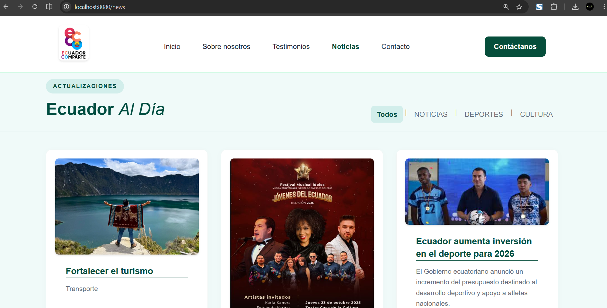

---

## 📌 URL del repositorio GitHub

```
https://github.com/TU_USUARIO/ecuador-comparte
```

> ⚠️ Reemplaza con el enlace real de tu repositorio público.

---

## 📖 Descripción del proyecto

**Ecuador Comparte** es una aplicación web desarrollada con **Spring Boot** que permite publicar y gestionar noticias, testimonios y solicitudes de contacto relacionados con la cultura, turismo, gastronomía y tradiciones del Ecuador.

### ✨ Funcionalidades principales

- **Página de inicio** con noticias destacadas y testimonios publicados.
- **Sección de noticias** con listado por categoría y vista de detalle.
- **Sección de testimonios** con listado filtrable por categoría y vista de detalle.
- **Formulario de contacto** para que los visitantes envíen mensajes.
- **Panel de administración (Dashboard)** protegido por autenticación, que permite:
  - Crear, editar y eliminar noticias y testimonios.
  - Ver y gestionar las solicitudes de contacto (cambiar estado, eliminar).
- **Autenticación** con Spring Security y roles (`ADMIN` / `USER`).

### 👥 Usuarios objetivo

Administradores del sitio que gestionan el contenido, y visitantes públicos que consumen las publicaciones.

---

## 🚀 Pasos para correr el proyecto

### Requisitos previos


| Herramienta | Versión recomendada        |
| ----------- | --------------------------- |
| Java        | 21                          |
| Gradle      | 9.x (incluido via Wrapper)  |
| PostgreSQL  | 14 o superior               |
| IDE         | IntelliJ IDEA (recomendado) |

### 1. Clonar el repositorio

```bash
git clone https://github.com/TU_USUARIO/ecuador-comparte.git
cd ecuador-comparte
```

### 2. Configurar la base de datos (PostgreSQL)

Crea la base de datos:

```sql
CREATE DATABASE "ecuador-comparte-db";
```

Verifica que el usuario sea `postgres` con contraseña `987654321`, o actualiza las credenciales en el archivo de configuración.

### 3. Configurar `application.properties`

El archivo se encuentra en `src/main/resources/application.properties`:

```properties
spring.datasource.url=jdbc:postgresql://localhost:5432/ecuador-comparte-db
spring.datasource.username=postgres
spring.datasource.password=987654321
spring.jpa.hibernate.ddl-auto=update
spring.jpa.defer-datasource-initialization=true
spring.sql.init.mode=never
```

> Si usas otras credenciales de PostgreSQL, ajusta `username` y `password`.

### 4. Ejecutar el proyecto

Con el Gradle Wrapper incluido:

```bash
# En Linux/macOS
./gradlew bootRun

# En Windows
gradlew.bat bootRun
```

O desde IntelliJ IDEA: abre el proyecto y ejecuta `EcuadorComparteApplication.java`.

### 5. Acceder al sistema

Una vez iniciado, el sistema estará disponible en:

```
http://localhost:8080
```

### 🔑 Credenciales de prueba


| Usuario | Contraseña           | Rol   |
| ------- | --------------------- | ----- |
| `admin` | *(ver UserSeed.java)* | ADMIN |

> El usuario administrador se crea automáticamente al iniciar la aplicación desde `UserSeed.java`.

---

## 📁 Estructura de carpetas

```
src/
├── main/
│   ├── java/dev/project/ecuadorcomparte/
│   │   ├── config/
│   │   │   ├── SecurityConfig.java
│   │   │   ├── UserSeed.java
│   │   │   └── WebMvcConfig.java
│   │   ├── controller/
│   │   │   ├── HomeController.java
│   │   │   ├── NewsController.java
│   │   │   ├── TestimonyController.java
│   │   │   ├── ContactController.java
│   │   │   ├── DashboardController.java
│   │   │   └── LoginController.java
│   │   ├── model/
│   │   │   ├── constant/
│   │   │   │   ├── Category.java
│   │   │   │   ├── ContactStatus.java
│   │   │   │   └── RoleName.java
│   │   │   ├── dto/
│   │   │   │   ├── NewsDTO.java
│   │   │   │   ├── TestimonyDTO.java
│   │   │   │   ├── ContactRequestDTO.java
│   │   │   │   └── ContactResponseDTO.java
│   │   │   ├── entity/
│   │   │   │   ├── AppUser.java
│   │   │   │   ├── News.java
│   │   │   │   ├── Testimony.java
│   │   │   │   ├── ContactRequest.java
│   │   │   │   └── Role.java
│   │   │   ├── repository/
│   │   │   │   ├── AppUserRepository.java
│   │   │   │   ├── NewsRepository.java
│   │   │   │   ├── TestimonyRepository.java
│   │   │   │   ├── ContactRequestRepository.java
│   │   │   │   └── RoleRepository.java
│   │   │   └── service/
│   │   │       ├── NewsService.java
│   │   │       ├── TestimonyService.java
│   │   │       └── ContactRequestService.java
│   │   └── EcuadorComparteApplication.java
│   └── resources/
│       ├── templates/
│       │   ├── home.html
│       │   ├── about.html
│       │   ├── login.html
│       │   ├── news/
│       │   │   ├── list.html
│       │   │   └── detail.html
│       │   ├── testimony/
│       │   │   ├── list.html
│       │   │   └── detail.html
│       │   ├── contact/
│       │   │   └── contact1.html
│       │   └── dashboard/
│       │       ├── index.html
│       │       ├── news.html
│       │       ├── news-form.html
│       │       ├── testimony.html
│       │       ├── testimony-form.html
│       │       ├── contacts.html
│       │       └── contact-detail.html
│       ├── static/
│       │   ├── styles.css
│       │   ├── styles1.css
│       │   ├── index.css
│       │   ├── login.css
│       │   └── images/
│       └── application.properties
└── test/
    └── java/dev/project/ecuadorcomparte/
        └── EcuadorComparteApplicationTests.java
```

---

## 🏗️ Diagrama de arquitectura (UML)

El proyecto sigue el patrón **MVC (Model-View-Controller)** con las siguientes capas:

- **Controller**: Recibe las peticiones HTTP y delega al servicio correspondiente.
- **Service**: Contiene la lógica de negocio y convierte entre entidades y DTOs.
- **Repository**: Interfaces JPA para acceder a la base de datos.
- **Entity/Model**: Clases Java mapeadas a tablas de PostgreSQL.
- **Config**: Configuración de seguridad (Spring Security + BCrypt).

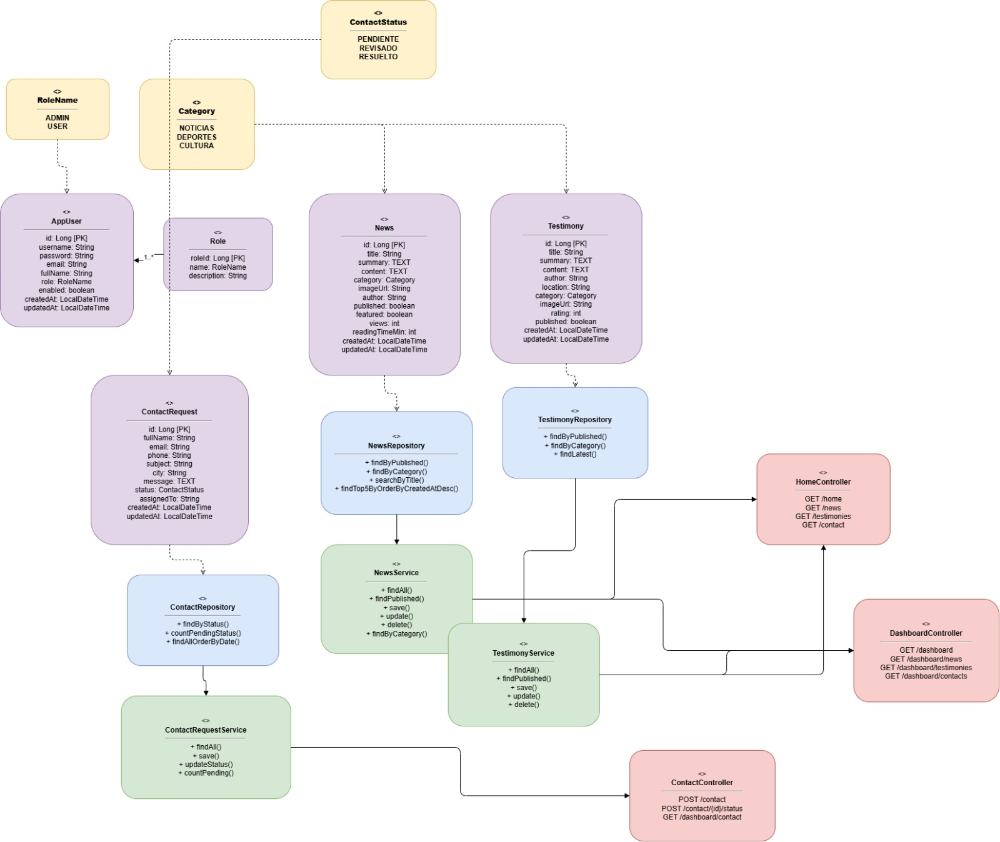

---

## 🗄️ Modelo Entidad/Relación (Base de Datos)

Las tablas principales en la base de datos son:


| Tabla              | Descripción                                    |
| ------------------ | ----------------------------------------------- |
| `users`            | Usuarios del sistema con rol y credenciales     |
| `roles`            | Roles disponibles: ADMIN, USER                  |
| `news`             | Noticias publicadas con categoría e imagen     |
| `testimonials`     | Testimonios de usuarios con autor y ubicación  |
| `contact_requests` | Solicitudes de contacto enviadas por visitantes |

Las entidades `news` y `testimonials` usan el enum `Category` con valores: `CULTURA`, `TURISMO`, `GASTRONOMIA`, `TRADICIONES`.

La entidad `contact_requests` usa el enum `ContactStatus` con valores: `PENDING`, `IN_PROGRESS`, `RESOLVED`, `CLOSED`.

### 📌 Diagrama Entidad/Relación

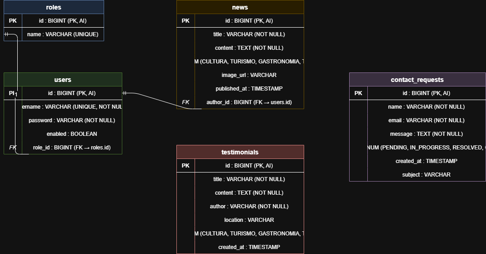

---

## 🌐 Endpoints disponibles


| Funcionalidad        | Ruta                               | Método    | Descripción                                   |
| -------------------- | ---------------------------------- | ---------- | ---------------------------------------------- |
| Inicio               | `/`                                | GET        | Redirecciona a`/home`                          |
| Home                 | `/home`                            | GET        | Página principal con noticias y testimonios   |
| Acerca de            | `/about`                           | GET        | Página informativa                            |
| Login                | `/login`                           | GET        | Formulario de autenticación                   |
| Lista noticias       | `/news`                            | GET        | Noticias publicadas (filtro por categoría)    |
| Detalle noticia      | `/news/{id}`                       | GET        | Vista de una noticia específica               |
| Lista testimonios    | `/testimony`                       | GET        | Testimonios publicados (filtro por categoría) |
| Detalle testimonio   | `/testimony/{id}`                  | GET        | Vista de un testimonio específico             |
| Contacto             | `/contact1`                        | GET / POST | Formulario de contacto                         |
| Dashboard            | `/dashboard`                       | GET        | Panel de administración (requiere auth)       |
| Gestión noticias    | `/dashboard/news`                  | GET        | Listado de noticias en dashboard               |
| Crear noticia        | `/dashboard/news/new`              | GET / POST | Formulario de nueva noticia                    |
| Editar noticia       | `/dashboard/news/{id}/edit`        | GET / POST | Formulario de edición                         |
| Eliminar noticia     | `/dashboard/news/{id}/delete`      | POST       | Elimina una noticia                            |
| Gestión testimonios | `/dashboard/testimony`             | GET        | Listado de testimonios en dashboard            |
| Crear testimonio     | `/dashboard/testimony/new`         | GET / POST | Formulario de nuevo testimonio                 |
| Editar testimonio    | `/dashboard/testimony/{id}/edit`   | GET / POST | Formulario de edición                         |
| Eliminar testimonio  | `/dashboard/testimony/{id}/delete` | POST       | Elimina un testimonio                          |
| Gestión contactos   | `/dashboard/contacts`              | GET        | Listado de solicitudes de contacto             |
| Detalle contacto     | `/dashboard/contacts/{id}`         | GET        | Detalle de una solicitud                       |
| Estado contacto      | `/dashboard/contacts/{id}/status`  | POST       | Actualiza el estado                            |
| Eliminar contacto    | `/dashboard/contacts/{id}/delete`  | POST       | Elimina una solicitud                          |

---

## 🛠️ Stack de tecnologías

### Backend


| Tecnología     | Versión           | Propósito                                   |
| --------------- | ------------------ | -------------------------------------------- |
| Java            | 21                 | Lenguaje principal                           |
| Spring Boot     | 4.0.6              | Framework principal                          |
| Spring Web MVC  | (incluido en Boot) | Controladores HTTP y vistas                  |
| Spring Data JPA | (incluido en Boot) | Persistencia y repositorios                  |
| Spring Security | (incluido en Boot) | Autenticación y autorización               |
| Hibernate       | (incluido en JPA)  | ORM para mapeo objeto-relacional             |
| Lombok          | (latest)           | Reducción de boilerplate (getters, setters) |
| Spring DevTools | (incluido en Boot) | Recarga automática en desarrollo            |

### Base de datos


| Tecnología  | Versión   | Propósito                             |
| ------------ | ---------- | -------------------------------------- |
| PostgreSQL   | 14+        | Base de datos principal en producción |
| H2 (console) | (incluido) | Consola en memoria para desarrollo     |

### Frontend / Vistas


| Tecnología  | Propósito                                     |
| ------------ | ---------------------------------------------- |
| Thymeleaf    | Motor de plantillas HTML del lado del servidor |
| HTML5 / CSS3 | Estructura y estilos de la interfaz            |

### Herramientas


| Herramienta      | Propósito                               |
| ---------------- | ---------------------------------------- |
| Gradle (Wrapper) | Gestión de dependencias y construcción |
| IntelliJ IDEA    | IDE recomendado                          |
| Git              | Control de versiones                     |

---

## 📸 Capturas UI/UX

### Página de inicio (`/home`)


### Lista de noticias con filtro por categoría

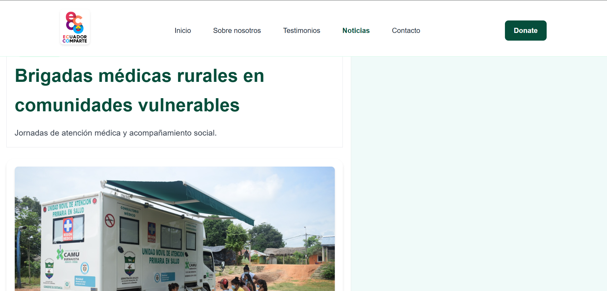

### Detalle de una noticia

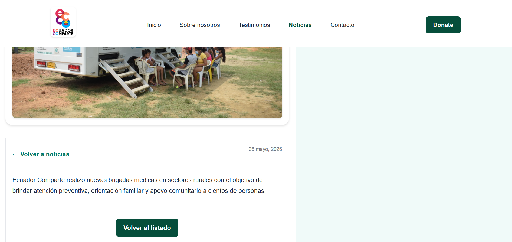

### Lista de testimonios

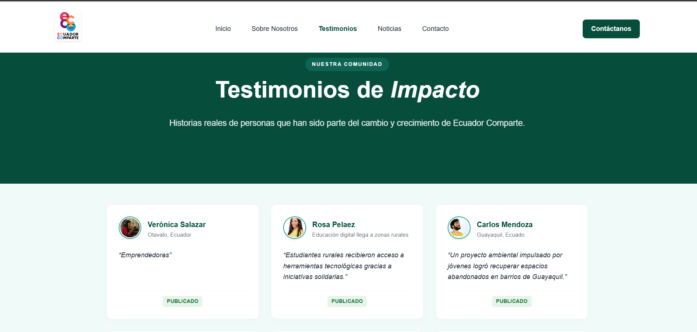

### Detalle de un testimonio

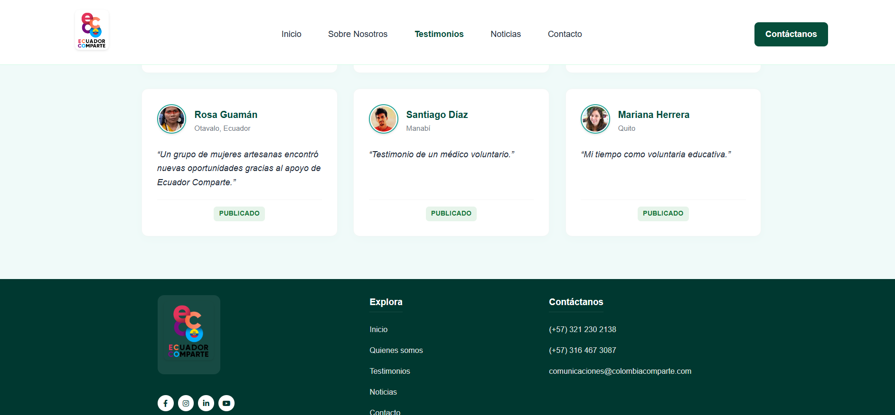

### Formulario de contacto

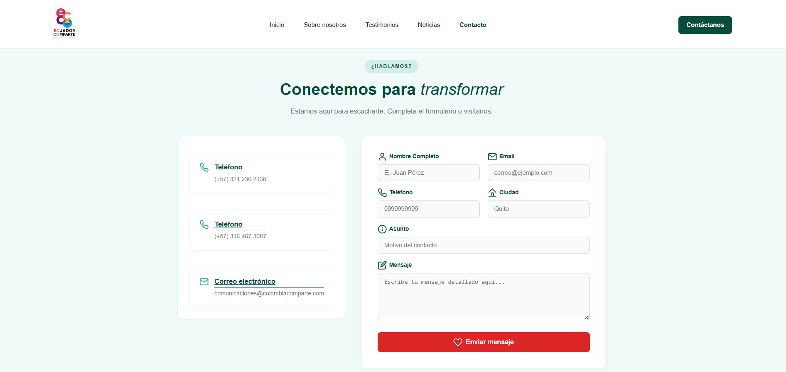

### Dashboard de administración

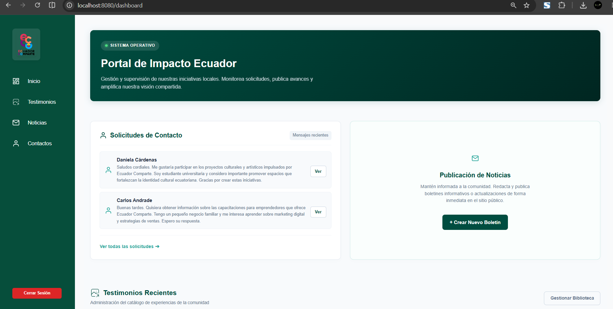

### Gestión de noticias en el dashboard

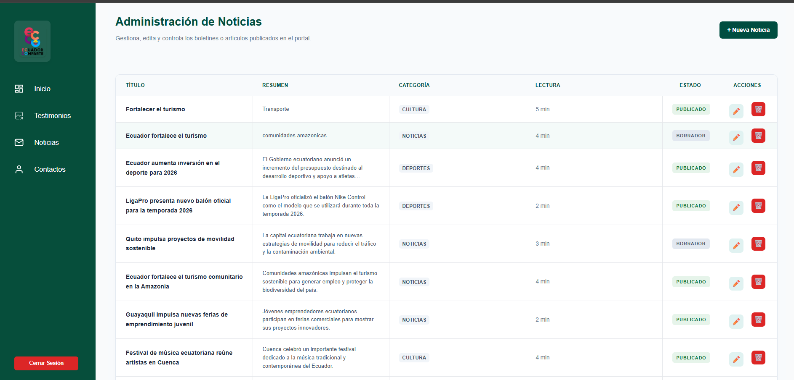

### Gestión de testimonios en el dashboard

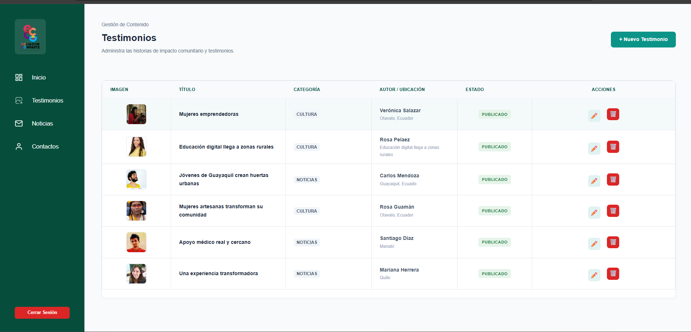

### Listado de contactos con estados

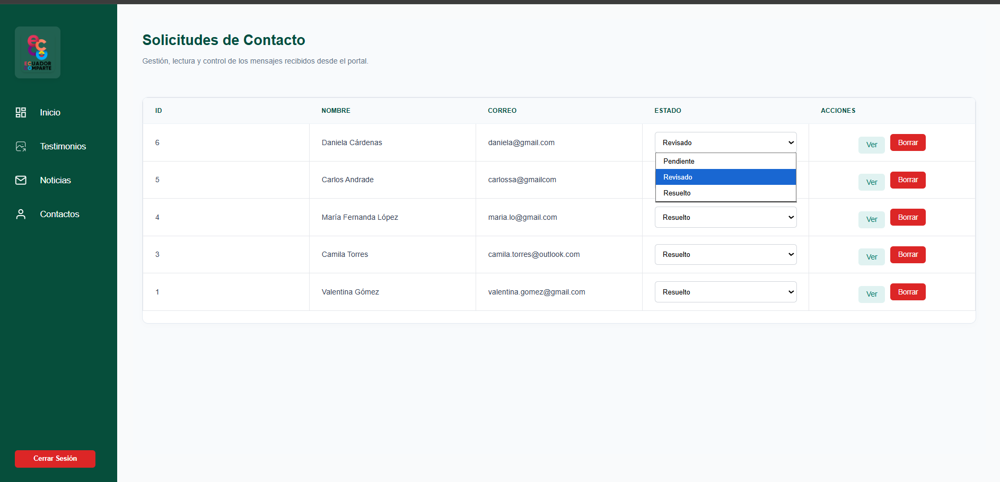

---

## 📊 Análisis personal

### Retos encontrados

Uno de los principales retos encontrados durante el desarrollo del proyecto fue la organización de las diferentes capas de la aplicación utilizando el patrón MVC. También fue un desafío la conexión y configuración de la base de datos PostgreSQL junto con Spring Boot y Spring Security para la autenticación de usuarios y manejo de roles.

Además, se presentaron dificultades al momento de gestionar las vistas con Thymeleaf, mantener una estructura ordenada del proyecto y realizar correctamente las operaciones CRUD para noticias, testimonios y contactos.

### Aprendizajes técnicos más valiosos

El desarrollo de este proyecto permitió comprender la importancia de mantener un orden y una buena arquitectura en aplicaciones web. Se fortalecieron conocimientos en Spring Boot, manejo de bases de datos con PostgreSQL, uso de DTOs, repositorios JPA y configuración de seguridad con Spring Security.

También se aprendió la importancia del trabajo organizado, la separación de responsabilidades entre capas y la correcta gestión de rutas, vistas y estilos. Estos aprendizajes serán muy importantes para futuros proyectos académicos y laborales.

<p align="center">
  Desarrollado con ❤️ para Ecuador
</p>
